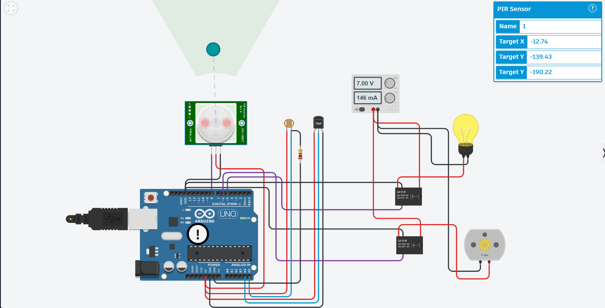

# 🏠 Home Automation System

An Arduino-based smart home automation system that automatically controls a **light bulb** and **fan** based on real-time motion detection, ambient light levels, and room temperature — simulated and built on **Tinkercad**.

---

## 📌 Features

- **Motion-triggered control** — system activates only when presence is detected (PIR sensor)
- **Ambient light sensing** — turns light ON/OFF based on LDR readings
- **Temperature-based fan control** — fan activates when temp exceeds 30°C
- **Relay-driven output** — safely switches AC-equivalent loads (bulb + fan motor)
- **Serial monitoring** — real-time sensor value logging via Serial Monitor

---

## 🔧 Components

| Component | Type | Pin |
|-----------|------|-----|
| Arduino UNO | Microcontroller | — |
| PIR Sensor (555-28027) | Digital Input | D8 |
| LDR + Resistor | Analog Input | A5 |
| TMP36 Temperature Sensor | Analog Input | A4 |
| Relay 1 (LU-5-R) | Digital Output | D5 |
| Relay 2 (LU-5-R) | Digital Output | D6 |
| Light Bulb | Load via Relay 1 | — |
| DC Motor (Fan) | Load via Relay 2 | — |
| Power Supply | 7V / 146mA | — |

---

## ⚙️ Working Logic

Motion is checked first. If **no motion** → both outputs OFF.

If **motion detected**:

| LDR Value | Temperature | Light (D5) | Fan (D6) |
|-----------|-------------|------------|----------|
| < 550 (Dark) | > 30°C | ON | ON |
| < 550 (Dark) | < 30°C | ON | OFF |
| > 550 (Bright) | > 30°C | OFF | ON |
| > 550 (Bright) | < 30°C | OFF | OFF |

---

## 📐 Pin Mapping

```
Arduino D8  → PIR Sensor (OUT)
Arduino A5  → LDR (voltage divider output)
Arduino A4  → TMP36 (VOUT)
Arduino D5  → Relay 1 IN → Light Bulb
Arduino D6  → Relay 2 IN → DC Motor (Fan)
```

---

## 🌡️ Temperature Calculation (TMP36)

```cpp
temp = (double)z / 1024;   // normalize ADC
temp = temp * 5;            // convert to voltage
temp = temp - 0.5;          // TMP36 offset
temp = temp * 100;          // convert to °C
```

---

## 🖥️ Simulation

Built and simulated on **Tinkercad Circuits**.



---

## 📁 Project Structure

```
home-automation-arduino/
├── README.md
├── src/
│   └── home_automation.ino
├── images/
│   └── circuit.png
└── docs/
    └── circuit_description.md
```

---

## 🚀 How to Run

1. Open `src/home_automation.ino` in Arduino IDE
2. Select Board: **Arduino UNO**
3. Upload to board or simulate on Tinkercad
4. Open Serial Monitor at **9600 baud** to view sensor readings

---

## 🔮 Future Scope

- Add ESP8266/ESP32 for Wi-Fi control via mobile app
- Integrate DHT11 for humidity-based control
- Add OLED display for real-time status
- Expand to multiple rooms with MQTT protocol

---

## 🏫 Associated With

Vishwakarma Institute of Technology
